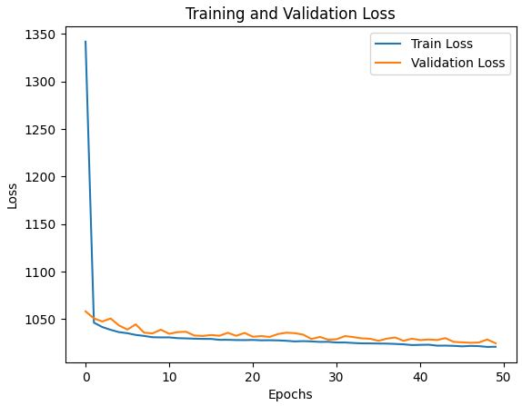

# RP2040 Pico-W Project with BME680 Sensor


## 1. Project Goal
- Evaluating the RP2040 Pico-W capabilities:
  - TPrepare complete toolchain including TinyML 
  - Assess Wi-Fi connectivity features
- Compare programming paradigms:
  - Analyze C++ performance and low-level control
 

 
## 2. Programming Environment Setup
- Hardware preparation:
  - Connect Pico-W to development machine(Proxmox Ubuntu VC)
  - Set up I2C power supply and necessary cables
 
    
    In my particular case I used pico zero as it was the cheapest one as a Pico A
    of course you need to connect to appropiate UART1 pins on Pico A
    
    

    
- Software configuration:
  - Add Raspberry Pi Pico extension to VSCode and Pico SDK and toolchain are automatically confugred
  - to use tfl-micro tensorflow light micro ned to clone git and first build 
  
- Debugging tools:
  - Set up OpenOCD for on-chip debugging( a bit work around(SWD) compared to ESP32)
  - Configure GDB for breakpoint debugging

## 3. Advanced Hardware Configuration
- Debugprobe setup:
  - Flashing second Pico with debugprobe firmware
  - Connect SWD lines between debugprobe and target Pico-W

All other details could be found under:
https://www.raspberrypi.com/documentation/microcontrollers/pico-series.html
<p>Download the <a href="[Documentation](https://www.raspberrypi.com/documentation/microcontrollers/pico-series.html)"></a></p>


- UART bridge configuration:
  - Set up UART pins on debugprobe for serial communication
  - Use standard  VSCode's serial monitor:
    - Port: /dev/ttyACM0
    - Baud rate: 115200
- Virtualization setup:
  - Ubuntu VM on Proxmox hypervisor was prepared with USB passthrough for USB-to-UART bridge
    


## 4. Code Analysis (7cpp.cpp)
Main function initializes the system, connects to Wi-Fi, sets up I2C communication, initializes a BME68X sensor, and starts a TCP server.

### Inputs

- No direct inputs, but uses predefined Wi-Fi credentials (WIFI_SSID, WIFI_PASSWORD) and hardware configurations (I2C_PORT, I2C_SDA, I2C_SCL, TCP_PORT).

### Outputs

1. Status messages printed to the console:
   - Wi-Fi connection status
   - IP address
   - I2C configuration details
 - MQTT Integration:
  - Implemented MQTT client library 

- Data flow:
  - Publishing sensor data to specific MQTT topics( domoticz/in)
  - Subscribing to topics for remote sensor configuration
 ```
08:49:54:033 -> mqtt.cpp-DEBUG: Processing last fragment of MQTT message
08:49:54:036 -> [mqtt] Received data: {"idx":243,"nvalue":0,"svalue":"65.80"}
08:49:54:041 -> [mqtt] {"idx" 243,"nvalue":0,"svalue":"65.80"}
08:49:54:045 -> [mqtt] 2001B36C
08:49:54:046 -> [mqtt] Added to queue
08:49:54:049 -> mqtt.cpp-lQueue stats: Count: 2, Head: 3, Tail: 1
08:49:54:053 -> mqtt.cpp-DEBUG: -Incoming publish at topic pico_w_347e_in with total length 38
08:49:54:061 -> mqtt.cpp-DEBUG: Entering mqtt_incoming_data_cb. Data length: 38, Flags: 1
08:49:54:291 -> mqtt.cpp-line82 DEBUG: Checking queue for messages
08:49:54:295 -> mqtt.cpp-lDEBUG: Attempting to pop from circular queue
08:49:54:300 -> mqtt.cpp-lDEBUG: Pop successful. New tail: 2, count: 1
2. A web server that serves sensor data to connected clients
```
- Lightweight webserver to diplay current sensor values/( also sent to MQTT broker ) and stored/displayed in domoticz 


4. TinyML trained quantised 8bit tflight model:
   - baseed on reading from sensor doing weather prediction( cloud coverage)
   - Model based on neural network was trained( on historical data) with Colab and then quantised to 8bit
   - Then as a library used in to predict cloud cover  for photovoltaic predictions
   - Whole tests are done to build toolchain  so all sorts of virtual sensors could implemented
 

### Key Points

- Extensive error checking at each initialization step ensures the system is fully operational before proceeding.
- The program only continues if Wi-Fi connection and TCP server setup are successful.
- The BME68X sensor is likely an environmental sensor for measuring temperature, humidity, pressure, and gas resistance.

## 5. Future Enhancements
- DMA at the moment is not working properly

- Scalability:
  - Design for multiple sensor support
  - Implement efficient data aggregation before transmission
 
 
  - 
 
Note: The extensive debugging code in 7cpp.cpp was crucial in identifying and resolving I2C initialization issues with the BME680 sensor, highlighting the importance of thorough error checking in embedded systems development.
Not so many advanced examples with the usage of TCP, MQTT stack.<pb>
- 3D scatter plot of historical data showing influence of humidity temperature and preassure on cloud cover
```
  <class 'pandas.core.frame.DataFrame'>
RangeIndex: 87648 entries, 0 to 87647
Data columns (total 5 columns):
 #   Column                Non-Null Count  Dtype         
---  ------                --------------  -----         
 0   time                  87648 non-null  datetime64[ns]
 1   temperature_2m        87648 non-null  float32       
 2   relative_humidity_2m  87648 non-null  float32       
 3   surface_pressure      87648 non-null  float32       
 4   cloud_cover           87648 non-null  float32       
dtypes: datetime64[ns](1), float32(4)
memory usage: 2.0 MB

Model: "sequential_4"

┏━━━━━━━━━━━━━━━━━━━━━━━━━━━━━━━━━━━━━━┳━━━━━━━━━━━━━━━━━━━━━━━━━━━━━┳━━━━━━━━━━━━━━━━━┓
┃ Layer (type)                         ┃ Output Shape                ┃         Param # ┃
┡━━━━━━━━━━━━━━━━━━━━━━━━━━━━━━━━━━━━━━╇━━━━━━━━━━━━━━━━━━━━━━━━━━━━━╇━━━━━━━━━━━━━━━━━┩
│ dense_12 (Dense)                     │ (None, 64)                  │             256 │
├──────────────────────────────────────┼─────────────────────────────┼─────────────────┤
│ dense_13 (Dense)                     │ (None, 64)                  │           4,160 │
├──────────────────────────────────────┼─────────────────────────────┼─────────────────┤
│ dense_14 (Dense)                     │ (None, 1)                   │              65 │
└──────────────────────────────────────┴─────────────────────────────┴─────────────────┘

 Total params: 13,445 (52.52 KB)

 Trainable params: 4,481 (17.50 KB)

 Non-trainable params: 0 (0.00 B)

 Optimizer params: 8,964 (35.02 KB)


```

, 

- trainig model  using metrics such as Mean Absolute Error (MAE), Mean Squared Error (MSE), and R-squared. 



Of course results( metrics) are not the spectacular but that step was required to have proof of concept and whole toolchain.
Later model could be finetuned, changed to be more robust

converting model trained on Colab to INT8
 

```
# Set the converter
converter = tf.lite.TFLiteConverter.from_keras_model(model)

# Set optimization to use 8-bit quantization
converter.optimizations = [tf.lite.Optimize.DEFAULT]

# Convert the model
tflite_model = converter.convert()

```
and saving as C header
```
# Update package list and install xxd
!apt-get update && apt-get -qq install xxd

# Convert the TFLite model to a C header file
!xxd -i /content/drive/MyDrive/tinyML/output/3_quantized_model.tflite > /content/drive/MyDrive/tinyML/output/model.h

# Display the contents of the header file
!cat model.h

```
```
Reading package lists... Done
W: Skipping acquire of configured file 'main/source/Sources' as repository 'https://r2u.stat.illinois.edu/ubuntu jammy InRelease' does not seem to provide it (sources.list entry misspelt?)
unsigned char _content_drive_MyDrive_tinyML_output_3_quantized_model_tflite[] = {
  0x20, 0x00, 0x00, 0x00, 0x54, 0x46, 0x4c, 0x33, 0x00, 0x00, 0x00, 0x00,
  0x14, 0x00, 0x20, 0x00, 0x1c, 0x00, 0x18, 0x00, 0x14, 0x00, 0x10, 0x00
.
,
.
.
unsigned int _content_drive_MyDrive_tinyML_output_3_quantized_model_tflite_len = 16488;


```

- Challengies on the way:
  - Getting free training set https://open-meteo.com/ nice with possibility to choose location time span and other parameters  for the model to train
  - train small model with reasonable  results
  - Implement efficient data aggregation before transmission
