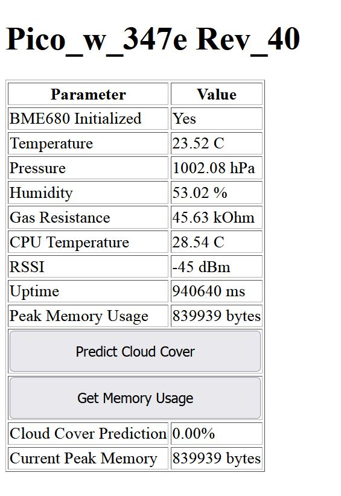

# RP2040 Pico-W Project with BME680 Sensor

## 1. Project Goal
- Evaluating the RP2040 Pico-W capabilities:
  - TPrepare complete toolchain including TinyML 
  - Assess Wi-Fi connectivity features
- Compare programming paradigms:
  - Analyze C++ performance and low-level control
 

 
## 2. Programming Environment Setup
- Hardware preparation:
  - Connect Pico-W to development machine(Proxmox Ubuntu VC)
  - Set up I2C power supply and necessary cables
 
    
    In my particular case I used pico zero as it was the cheapest one as a Pico A
    of course you need to connect to appropiate UART1 pins on Pico A
    
    

    
- Software configuration:
  - Add Raspberry Pi Pico extension to VSCode and Pico SDK and toolchain are automatically confugred
  - to use tfl-micro tensorflow light micro ned to clone git and first build 
  
- Debugging tools:
  - Set up OpenOCD for on-chip debugging( a bit work around(SWD) compared to ESP32)
  - Configure GDB for breakpoint debugging

## 3. Advanced Hardware Configuration
- Debugprobe setup:
  - Flashing second Pico with debugprobe firmware
  - Connect SWD lines between debugprobe and target Pico-W

All other details could be found under:
https://www.raspberrypi.com/documentation/microcontrollers/pico-series.html

Download the 

- UART bridge configuration:
  - Set up UART pins on debugprobe for serial communication
  - Use standard  VSCode's serial monitor:
    - Port: /dev/ttyACM0
    - Baud rate: 115200
- Virtualization setup:
  - Ubuntu VM on Proxmox hypervisor was prepared with USB passthrough for USB-to-UART bridge
    

## 4. Code Analysis (7cpp.cpp)
Main function initializes the system, connects to Wi-Fi, sets up I2C communication, initializes a BME68X sensor, and starts a TCP server.

### Inputs

- No direct inputs, but uses predefined Wi-Fi credentials (WIFI_SSID, WIFI_PASSWORD) and hardware configurations (I2C_PORT, I2C_SDA, I2C_SCL, TCP_PORT).

### Outputs

1. Status messages printed to the console:
   - Wi-Fi connection status
   - IP address
   - I2C configuration details
 - MQTT Integration:
  - Implemented MQTT client library 

- Data flow:
  - Publishing sensor data to specific MQTT topics( domoticz/in)
  - Subscribing to topics for remote sensor configuration    
2. A web server that serves sensor data to connected clients

4. TinyML trained quantised 8bit tflight model:
   - baseed on reading from sensor doing weather prediction( cloud coverage)
   - Model based on neural network was trained( on historical data) with Colab and then quantised to 8bit
   - Then as a library used in to predict cloud cover  for photovoltaic predictions
   - Whole tests are done to build toolchain  so all sorts of virtual sensors could implemented
 

### Key Points

- Extensive error checking at each initialization step ensures the system is fully operational before proceeding.
- The program only continues if Wi-Fi connection and TCP server setup are successful.
- The BME68X sensor is likely an environmental sensor for measuring temperature, humidity, pressure, and gas resistance.

## 5. Future Enhancements
- DMA at the moment is not working properly

- Scalability:
  - Design for multiple sensor support
  - Implement efficient data aggregation before transmission
 
 
  - 
 
Note: The extensive debugging code in 7cpp.cpp was crucial in identifying and resolving I2C initialization issues with the BME680 sensor, highlighting the importance of thorough error checking in embedded systems development.
Not so many advanced examples with the usage of TCP, MQTT stack.

- Challengies on the way:
  - Getting free training set https://open-meteo.com/ nice with possibility to choose location time span and other parameters  for the model to train
  - train small model with reasonable  results
  - Implement efficient data aggregation before transmission
